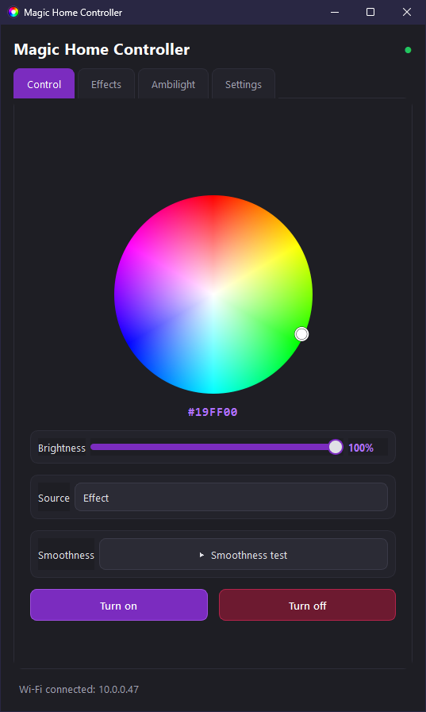
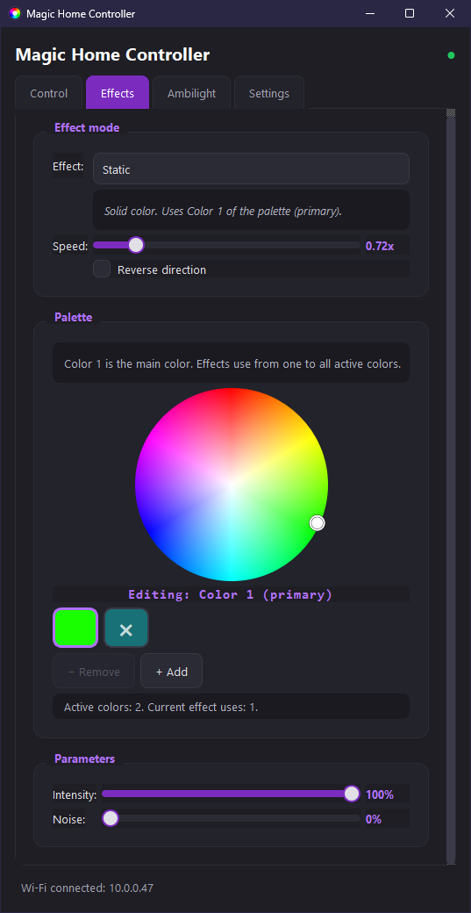
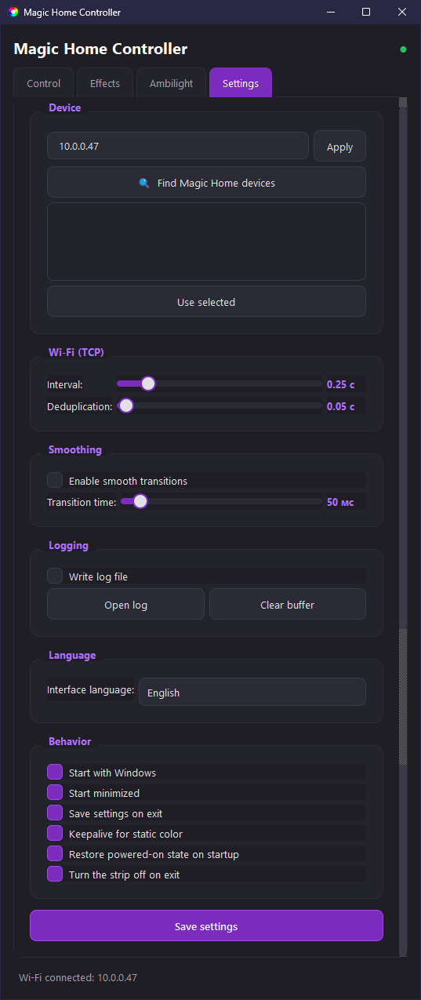
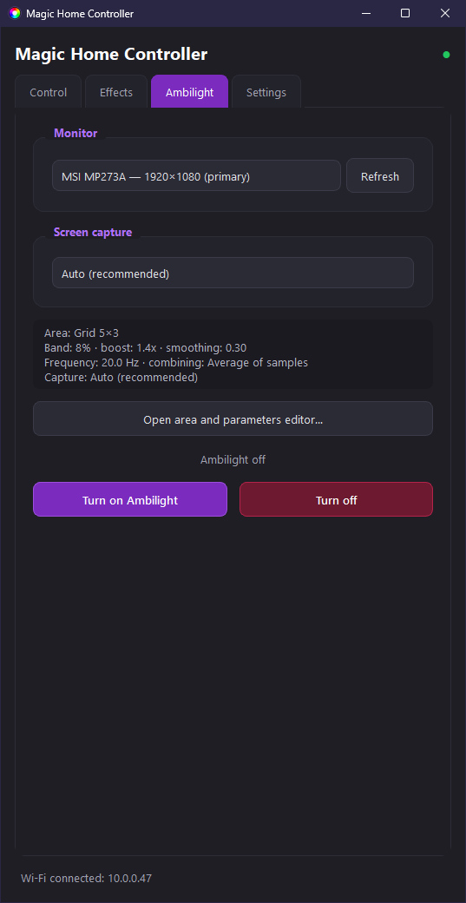
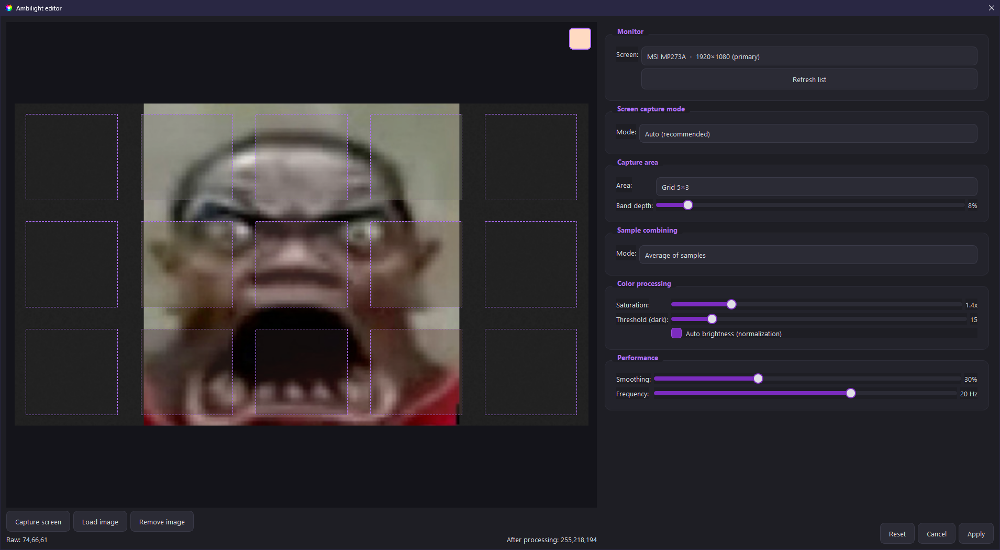
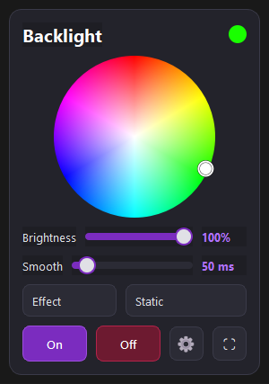
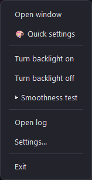

<div align="center">

# Magic Home Controller

🌐 **Available in:** 🇬🇧 **English** | [🇷🇺 Русский](README_RU.md)

</div>

<p align="center">
  
</p>

---

## Features

- Wi-Fi device discovery (UDP) and control over TCP (Magic Home protocol, port 5577) with automatic reconnection
- HSV color wheel, brightness, smooth transitions, and editable palettes of two to four colors
- Ambilight screen capture with monitor, region, and capture-backend selection (WGC, DXGI, GDI with automatic switching)
- 11 effects and 13 capture regions including grids and a custom rectangle
- System tray, quick-settings popup, and diagnostic log window
- Persistent settings and optional Windows startup

### Effects

| Effect | Description |
| :- | :- |
| **Static** | Solid color — Color 1 of the palette |
| **Breath** | Smooth fade-out and fade-in of Color 1 |
| **Rainbow (HSV)** | Full HSV cycle (the palette is not used) |
| **Gradient** | Smooth transition between Color 1 and Color 2 of the palette |
| **Strobe** | Rapid flashes of Color 1 (on/off) |
| **Pulse** | Decaying pulse of Color 1 |
| **Wave** | Wave across the whole palette (ease-in-out) |
| **Fire** | Random flashes of palette colors, imitating fire |
| **Random flashes** | Random palette color, changing about 4 times per second |
| **Chase** | Fast circular cycling of palette colors |
| **Color cycle** | Smooth cyclic transition through all palette colors |

---

## Screenshots

<p align="center">
  
  
  
</p>

<p align="center">
  
  
</p>

<p align="center">
  
  
</p>

---

## Installation

1. Open the [**Releases**](https://github.com/HelloGames-ds/magic-home-controller/releases/latest) page.
2. [**Download the latest version**](https://github.com/HelloGames-ds/magic-home-controller/releases/latest) — the `Magic-Home-Controller-Setup-1.0-x64.exe` installer.
3. Run the installer and accept the Windows UAC prompt.
4. Launch **Magic Home Controller** from the Start menu or the desktop shortcut.

The installer (~38 MB) includes the Qt libraries and MSVC Runtime, so nothing needs to be installed separately. The default directory is `C:\Program Files\Magic Home Controller`.

---

## First connection

Make sure the controller and your computer are on the same network.

You can enter the controller IP manually on the **Settings** tab, or find it automatically:

1. Open the **Settings** tab.
2. Click **Find Magic Home devices**.
3. Select the controller from the list and click **Use selected** (the IP will be filled in).

The application automatically reconnects after a temporary connection loss and restores the last color/pattern.

---

## Building from source

Required tools for Windows (MSVC x64, C++17):

- [Visual Studio](https://visualstudio.microsoft.com/) — workload «Desktop development with C++»
- [CMake](https://cmake.org/download/)
- [Ninja](https://ninja-build.org/)
- [Qt 6.8](https://www.qt.io/download-qt-installer) — Widgets and Network modules
- [Inno Setup 6](https://jrsoftware.org/isinfo.php) — only for building the installer
- C++/WinRT headers (in the `vendor/winrt` directory)

Build the portable Release package:

```bat
build-release.cmd
```

The result is written to `dist-cpp\`.

Build the Windows installer:

```bat
build-installer.cmd
```

The installer is written to `installer-output\Magic-Home-Controller-Setup-1.0-x64.exe`.

---

## Settings and logs

Settings and logs are stored in `%APPDATA%\Magic Home Controller`:

- `config.ini` — settings
- `last.log` — diagnostic log

These are per-user and not stored in the installation directory.

---

## License

MIT License. See [LICENSE](LICENSE).
