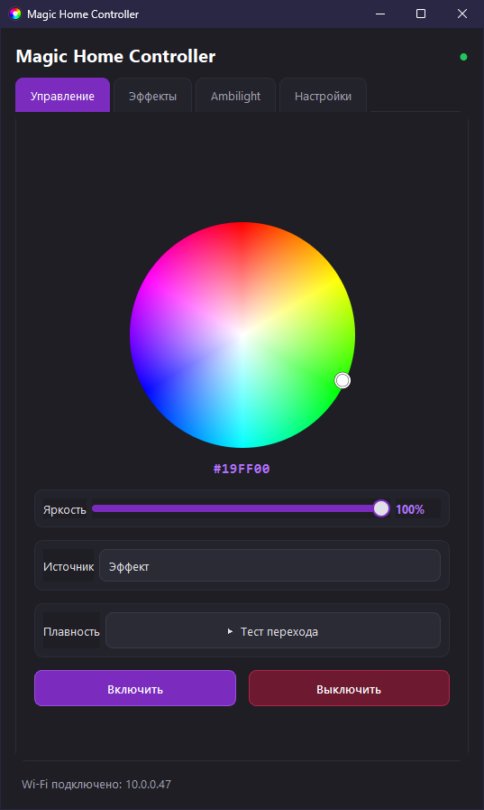
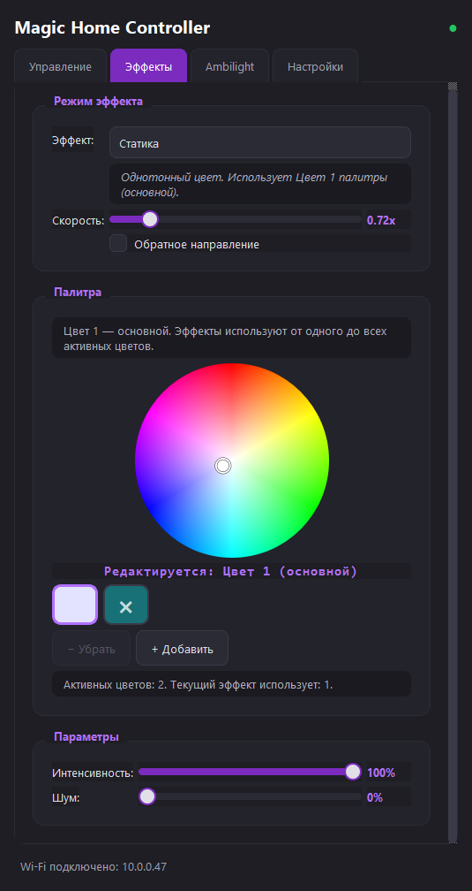
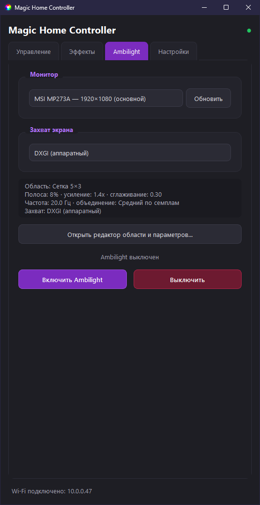
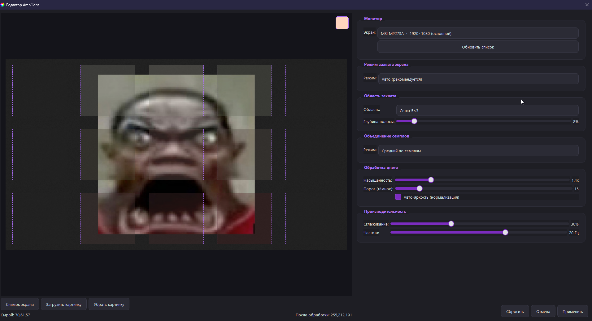
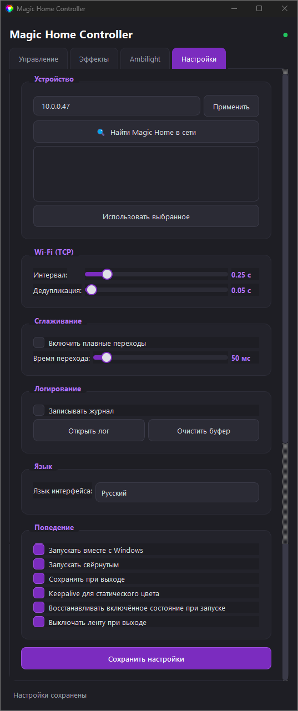
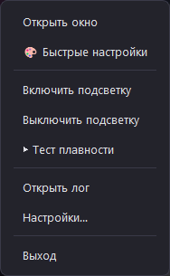

<div align="center">

# Magic Home Controller

🌐 **Доступно на:** [🇬🇧 English](README.md) | 🇷🇺 **Русский**

</div>

<p align="center">
  
</p>

---

## Возможности

- Поиск устройств по Wi-Fi (UDP) и управление по TCP (протокол Magic Home, порт 5577) с автопереподключением
- HSV-колесо, яркость, плавные переходы и редактируемая палитра из двух–четырёх цветов
- Ambilight: захват экрана с выбором монитора, области и бэкенда (WGC, DXGI, GDI) с автопереключением
- 11 эффектов и 13 областей захвата, включая сетки и пользовательский прямоугольник
- Системный трей, окно быстрых настроек и диагностический журнал
- Сохранение настроек и необязательный автозапуск Windows

### Эффекты

| Эффект | Описание |
| :- | :- |
| **Static** | Сплошной цвет — Цвет 1 палитры |
| **Breath** | Плавное затухание и проявление Цвета 1 |
| **Rainbow (HSV)** | Полный HSV-цикл (палитра не используется) |
| **Gradient** | Плавный переход между Цветом 1 и Цветом 2 палитры |
| **Strobe** | Быстрые вспышки Цвета 1 (вкл/выкл) |
| **Pulse** | Затухающий импульс Цвета 1 |
| **Wave** | Волна по всей палитре (ease-in-out) |
| **Fire** | Случайные вспышки цветов палитры — имитация огня |
| **Random flashes** | Случайный цвет палитры, смена ~4 раза в секунду |
| **Chase** | Быстрое круговое перебирание цветов палитры |
| **Color cycle** | Плавный циклический перебор всех цветов палитры |

---

## Скриншоты

| Главный экран | Эффекты | Ambilight |
| :-: | :-: | :-: |
|  |  |  |

| Редактор Ambilight | Настройки | Трей |
| :-: | :-: | :-: |
|  |  |  |

---

## Установка

1. Зайдите на страницу [**Releases**](https://github.com/HelloGames-ds/magic-home-controller/releases/latest).
2. [**Скачайте последнюю версию**](https://github.com/HelloGames-ds/magic-home-controller/releases/latest) — установщик `Magic-Home-Controller-Setup-1.0-x64.exe`.
3. Запустите установщик и подтвердите запрос UAC.
4. Запустите **Magic Home Controller** из меню «Пуск» или с ярлыка на рабочем столе.

Установщик (~38 МБ) включает библиотеки Qt и MSVC Runtime — ничего устанавливать отдельно не нужно. По умолчанию программа ставится в `C:\Program Files\Magic Home Controller`.

---

## Первое подключение

Компьютер и контроллер должны быть в одной сети. IP можно ввести вручную на вкладке **Настройки** или найти автоматически:

1. Вкладка **Настройки** → **Найти Magic Home устройства**.
2. Выберите контроллер из списка и нажмите **Использовать выбранное** — IP подставится автоматически.

При временном разрыве приложение само переподключается и восстанавливает последний цвет/паттерн.

---

## Сборка из исходного кода

Необходимые инструменты (для Windows, MSVC x64, C++17):

- [Visual Studio](https://visualstudio.microsoft.com/) — workload «Разработка классических приложений на C++»
- [CMake](https://cmake.org/download/)
- [Ninja](https://ninja-build.org/)
- [Qt 6.8](https://www.qt.io/download-qt-installer) — модули Widgets и Network
- [Inno Setup 6](https://jrsoftware.org/isinfo.php) — только для сборки установщика
- Заголовки C++/WinRT (в каталоге `vendor/winrt`)

Сборка переносимой Release-версии:

```bat
build-release.cmd
```

Результат появится в `dist-cpp\`.

Сборка установщика:

```bat
build-installer.cmd
```

Готовый установщик:

```text
installer-output\Magic-Home-Controller-Setup-1.0-x64.exe
```

---

## Настройки и журнал

Приложение хранит настройки и журнал в папке `%APPDATA%\Magic Home Controller` (у текущего пользователя, а не в каталоге установки):

- `config.ini` — настройки
- `last.log` — диагностический журнал

---

## Лицензия

MIT License. См. [LICENSE](LICENSE).
